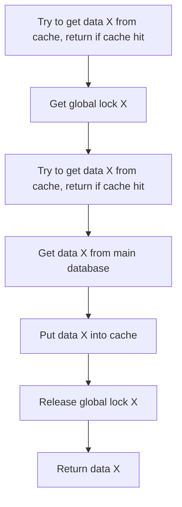

# Cache

## Handle cache miss

```mermaid
flowchart TD
  step1[Try to get data X from cache, return if cache hit]
  step2[Get global lock X]
  step3[Try to get data X from cache, return if cache hit]
  step4[Get data X from main database]
  step5[Put data X into cache]
  step6[Release global lock X]
  step7[Return data X]

  step1 --> step2
  step2 --> step3
  step3 --> step4
  step4 --> step5
  step5 --> step6
  step6 --> step7
```