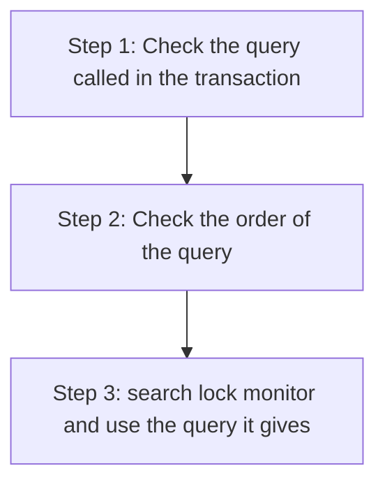
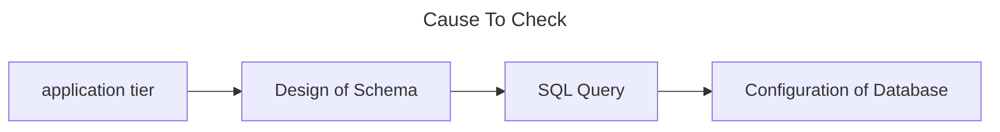

# Database

- [Add Index](#add-index)
- [Handle Deadlock](#handle-deadlock)
- [Case: Database is slow](#case-database-is-slow)

## Add Index


Questions to ask yourself before adding Index:

- 若已經做了 time-based partitioning ，也許不需要再做 index
- 若只是偶爾查詢， Full Table Scan 並不是不好的選擇

> p.s Sequential Read 原則上不應該大於5秒

- 如果用戶多數時只關心「活躍」的 Record ，你可以考慮把 table 分割
    - 已完成的訂單、未完成的訂單

Questions to ask yourself when adding Index:

1. 如果你要增加的是 unique index ，你有強烈原因不讓它作為 table 的 Natural key 嗎? (沒搞懂原因)
2. 你的資料庫是讀重要還是寫重要?
3. non-unique index 能使 candidate records 數目變到 100 下。 E.g.

    ```sql
    -- 創建非唯一索引
    CREATE INDEX idx_category ON products(Category);

    -- 查詢某一商品類別的商品
    SELECT * FROM products WHERE Category = 'Electronics';
    ```
4. 是否真的需要「即時性」的資料?


## Handle Concurrency

## Handle Deadlock



For Step 1, Step 2:

- You can give the transaction a name (from context for example) to identify queries
- Remember only use "two" thread for testing

## Case: Database is Slow



> Cofiguration of Database: eg. In a computer with 16GB RAM, only 256MB is utilized