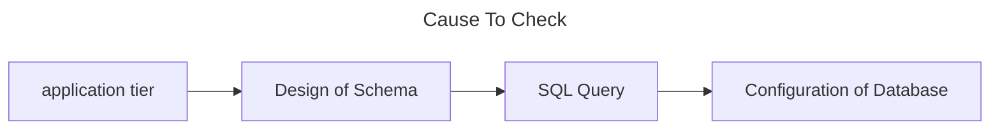

# Database

## Case: Database is slow

```mermaid
---
title: Cause To Check
---
flowchart LR
    at[application tier] --> dos[Design of Schema]
    dos --> sq[SQL Query]
    sq --> cod[Configuration of Database]
```

> Cofiguration of Database: eg. In a computer with 16GB RAM, only 256MB is utilized