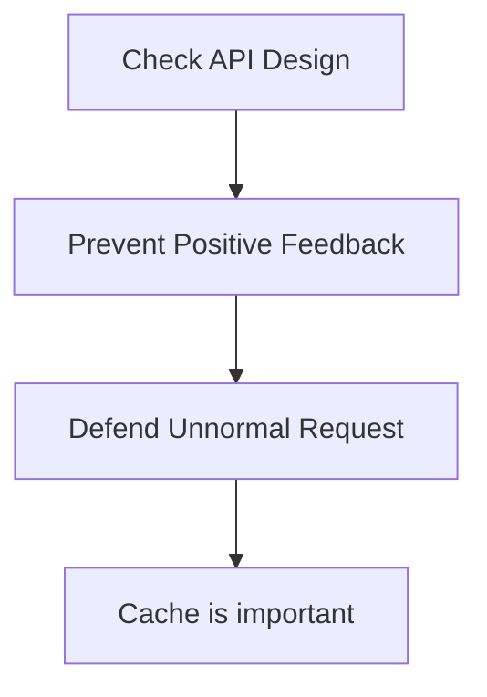

# System

## Design a system

### Check API Design

1. 單一行動請不要用2個 Request 來處理
    - 例如：轉帳請不要用兩次 PUT User_balances API ，而是用一次 POST Transfer API
    - 避免 race condition

### Prevent Postive Feedback

Postive feedback: 簡言之，就是使用者不斷按重新整理導致 request 大增

1. 可以先讓部分網頁顯示
2. 可以先接收使用者的 Request (HTTP 202(Accepted))
    - 很多網上訂位系統，都是先收下用戶指令，然後再慢慢處理
3. 對部份用戶返回 HTTP 503

### Defend Unnormal Request

1. 請先在 application tier 阻擋有問題的 request